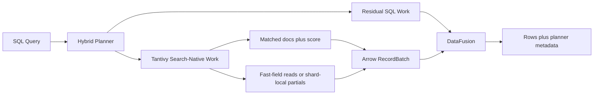

<p align="center">
  
</p>

# FerrisSearch

<p align="center">
  <strong>A Rust-native distributed search and search-aware analytics engine with Raft consensus, hybrid vector search, OpenSearch-compatible APIs, and SQL over matched docs — powered by <a href="https://github.com/quickwit-oss/tantivy">Tantivy</a></strong>
</p>

<p align="center">
  <a href="#getting-started">Getting Started</a> &middot;
  <a href="#api-reference">API Reference</a> &middot;
  <a href="#how-hybrid-sql-works">Architecture</a> &middot;
  <a href="#benchmarks">Benchmarks</a> &middot;
  <a href="#replication">Replication</a> &middot;
  <a href="#testing">Testing</a> &middot;
  <a href="#roadmap">Roadmap</a>
</p>

---

FerrisSearch is a high-performance, Rust-native distributed search engine with OpenSearch-compatible REST APIs, hybrid vector retrieval, and a search-aware SQL layer for querying matched documents as a dataset. It is built for teams that want the familiar OpenSearch interface with the performance and safety of Rust, without giving up on structured analytics over search results.

> **⚡ Performance:** 2M documents — ingestion at **10,402 docs/sec**, search at **142.4 queries/sec (p50 = 24.8ms)**, zero errors — [see benchmarks](#benchmarks)

## Highlights

- **OpenSearch-compatible REST API** — drop-in `PUT /{index}`, `POST /_doc`, `GET /_search` endpoints
- **Raft consensus** — cluster state managed by [openraft](https://github.com/datafuselabs/openraft); quorum-based leader election, linearizable writes, automatic failover, persistent log storage via [redb](https://github.com/cberner/redb)
- **Vector search** — k-NN approximate nearest neighbor search via [USearch](https://github.com/unum-cloud/usearch) (HNSW algorithm); hybrid full-text + vector queries
- **Search-aware SQL** — SQL over matched docs with pushdown-aware planning, local fast-field execution when possible, planner metadata, and grouped analytics over the matched result set
- **Distributed clustering** — multi-node clusters with shard-based data distribution
- **Synchronous replication** — primary-replica replication over gRPC; writes acknowledged only after all in-sync replicas confirm
- **Scatter-gather search** — queries fan out across shards, results merged and returned
- **Crash recovery** — binary write-ahead log (WAL) with configurable durability (`request` fsync-per-write or `async` timer-based); sequence number checkpointing and translog-based replica recovery
- **Zero external dependencies** — no JVM, no Zookeeper, just a single binary

## Why FerrisSearch Is Different

FerrisSearch is not just exposing SQL on top of a search API. The current direction is a true hybrid execution model:

- **Tantivy executes search-native work first**: full-text matching, scoring, and pushdown-friendly structured filters
- **Fast fields stay in the hot path**: when the query is eligible and shards are local, structured columns are read directly from Tantivy fast fields instead of materializing `_source`
- **SQL runs on matched docs, not the whole index**: Arrow and DataFusion operate on the narrowed result set or merged partial states
- **Planner metadata is visible**: responses show `execution_mode` and a `planner` block so you can see what was pushed down vs. what stayed residual

That makes FerrisSearch useful for workflows like:

- relevance debugging with `score` and structured filters in one query
- grouped analytics over matched docs
- internal dashboards over live search results
- interactive search + analysis without moving logic into client code

## How Hybrid SQL Works



The intended execution order is:

1. Tantivy handles `text_match(...)`, scoring, and pushdown-friendly structured filters.
2. Eligible structured columns are read directly from fast fields.
3. Arrow batches represent matched docs or merged partial states.
4. DataFusion executes only the remaining relational work.
5. The API returns rows plus `execution_mode` and `planner` metadata.

## Getting Started

### Prerequisites

- Rust (2024 edition)
- Protobuf compiler (`protoc`)

### Single node

```bash
cargo run
```

### Docker

```bash
docker build -t ferrissearch .
docker run -p 9200:9200 -p 9300:9300 ferrissearch
```

```bash
curl http://localhost:9200/
```
```json
{"name": "ferrissearch-node", "version": "0.1.0", "engine": "tantivy"}
```

### Multi-node cluster

```bash
# Terminal 1
./dev_cluster.sh 1    # HTTP 9200 · Transport 9300 · Raft ID 1

# Terminal 2
./dev_cluster.sh 2    # HTTP 9201 · Transport 9301 · Raft ID 2

# Terminal 3
./dev_cluster.sh 3    # HTTP 9202 · Transport 9302 · Raft ID 3
```
### Configuration

Configure via `config/ferrissearch.yml` or `FERRISSEARCH_*` environment variables:

| Option | Default | Description |
|--------|---------|-------------|
| `node_name` | `node-1` | Node identifier |
| `cluster_name` | `ferrissearch` | Cluster name |
| `http_port` | `9200` | REST API port |
| `transport_port` | `9300` | gRPC transport port |
| `data_dir` | `./data` | Data storage directory |
| `seed_hosts` | `["127.0.0.1:9300"]` | Seed nodes for discovery |
| `raft_node_id` | `1` | Unique Raft consensus node ID |
| `translog_durability` | `request` | Translog fsync mode: `request` (per-write) or `async` (timer) |
| `translog_sync_interval_ms` | (unset) | Background fsync interval when durability is `async` (default: 5000) |

## API Reference

### Indices

```bash
# Create an index
curl -X PUT 'http://localhost:9200/my-index' \
  -H 'Content-Type: application/json' \
  -d '{"settings": {"number_of_shards": 1, "number_of_replicas": 1}}'

# Create an index with field mappings
curl -X PUT 'http://localhost:9200/movies' \
  -H 'Content-Type: application/json' \
  -d '{
    "settings": {"number_of_shards": 3, "number_of_replicas": 1},
    "mappings": {
      "properties": {
        "title":     {"type": "text"},
        "genre":     {"type": "keyword"},
        "year":      {"type": "integer"},
        "rating":    {"type": "float"},
        "embedding": {"type": "knn_vector", "dimension": 3}
      }
    }
  }'

# Delete an index
curl -X DELETE 'http://localhost:9200/my-index'

# Get index settings
curl 'http://localhost:9200/my-index/_settings'

# Update dynamic settings (refresh_interval, number_of_replicas)
curl -X PUT 'http://localhost:9200/my-index/_settings' \
  -H 'Content-Type: application/json' \
  -d '{"index": {"refresh_interval": "2s", "number_of_replicas": 2}}'
```

**Supported field types:** `text` (analyzed), `keyword` (exact match), `integer`, `float`, `boolean`, `knn_vector`.
Unmapped fields are indexed into a catch-all "body" field for backward compatibility.

### Documents

```bash
# Index a document (auto-generated ID)
curl -X POST 'http://localhost:9200/my-index/_doc' \
  -H 'Content-Type: application/json' \
  -d '{"title": "Hello World", "tags": "rust search"}'

# Index a document with explicit ID
curl -X PUT 'http://localhost:9200/my-index/_doc/1' \
  -H 'Content-Type: application/json' \
  -d '{"title": "Hello World", "year": 2024}'

# Get a document
curl 'http://localhost:9200/my-index/_doc/{id}'

# Delete a document
curl -X DELETE 'http://localhost:9200/my-index/_doc/{id}'

# Partial update a document (merge fields)
curl -X POST 'http://localhost:9200/my-index/_update/1' \
  -H 'Content-Type: application/json' \
  -d '{"doc": {"rating": 9.5, "genre": "scifi"}}'

# Bulk index
curl -X POST 'http://localhost:9200/my-index/_bulk' \
  -H 'Content-Type: application/json' \
  -d '[
    {"_doc_id": "doc-1", "_source": {"name": "Alice"}},
    {"_doc_id": "doc-2", "_source": {"name": "Bob"}}
  ]'
```

### Search

```bash
# Match all
curl 'http://localhost:9200/my-index/_search'

# Query string with pagination
curl 'http://localhost:9200/my-index/_search?q=rust&from=0&size=10'

# DSL: match query
curl -X POST 'http://localhost:9200/my-index/_search' \
  -H 'Content-Type: application/json' \
  -d '{"query": {"match": {"title": "search engine"}}}'

# DSL: bool query (must + must_not)
curl -X POST 'http://localhost:9200/my-index/_search' \
  -H 'Content-Type: application/json' \
  -d '{
    "query": {
      "bool": {
        "must": [{"match": {"title": "rust"}}],
        "must_not": [{"match": {"title": "web"}}]
      }
    }
  }'

# DSL: bool query (should = OR)
curl -X POST 'http://localhost:9200/my-index/_search' \
  -H 'Content-Type: application/json' \
  -d '{
    "query": {
      "bool": {
        "should": [
          {"match": {"title": "rust"}},
          {"match": {"title": "python"}}
        ]
      }
    },
    "from": 0,
    "size": 5
  }'

# Fuzzy query (typo-tolerant search)
curl -X POST 'http://localhost:9200/my-index/_search' \
  -H 'Content-Type: application/json' \
  -d '{"query": {"fuzzy": {"title": {"value": "rsut", "fuzziness": 2}}}}'
```

### Search-Aware SQL

`POST /{index}/_sql` runs a SQL query over the matched document set. Tantivy still handles text matching, relevance scoring, and pushed-down structured filters; Arrow and DataFusion handle the residual SQL-style projection, ordering, grouping, and aggregation after search-aware planning.

Current behavior:

- `text_match(field, 'query')` is pushed into Tantivy
- simple `=`, `>`, `>=`, `<`, `<=` predicates on structured fields are pushed into Tantivy filters
- `score` is exposed as a normal SQL column
- projection, `ORDER BY score`, `avg(field)`, `count(*)`, and `GROUP BY` are supported
- eligible `GROUP BY` queries with shard-local grouped partial execution return `"execution_mode": "tantivy_grouped_partials"`
- when all shards for the target index are local and the query does not use `SELECT *`, non-grouped SQL reads Tantivy fast fields directly and returns `"execution_mode": "tantivy_fast_fields"`
- cross-node or wildcard-projection queries fall back to the compatibility path and return `"execution_mode": "materialized_hits_fallback"`
- responses include a `planner` section showing pushed-down filters, grouping columns, required columns, and whether residual SQL predicates remained

> **Current limitations:** the SQL layer now supports distributed grouped partial execution for eligible `GROUP BY` queries, but it is not yet a complete distributed partial SQL engine. The remaining roadmap is focused on deeper planner pushdown, stronger type/null fidelity, richer SQL semantics, and better execution diagnostics.

```bash
# Explain a SQL plan without executing it
curl -X POST 'http://localhost:9200/products/_sql/explain' \
  -H 'Content-Type: application/json' \
  -d '{
    "query": "SELECT brand, count(*) AS total FROM products WHERE text_match(description, '\''iphone'\'') AND price > 500 GROUP BY brand ORDER BY total DESC"
  }'
```

<details>
<summary>Example EXPLAIN response</summary>

```json
{
  "index": "products",
  "original_sql": "SELECT brand, count(*) AS total FROM products WHERE text_match(description, 'iphone') AND price > 500 GROUP BY brand ORDER BY total DESC",
  "rewritten_sql": "SELECT brand, count(*) AS total FROM matched_rows GROUP BY brand ORDER BY total DESC",
  "execution_strategy": "tantivy_grouped_partials",
  "strategy_reason": "Eligible GROUP BY query can execute as shard-local grouped partial aggregation",
  "columns": { "required": ["brand", "price"], "group_by": ["brand"], "selects_all": false, "uses_grouped_partials": true },
  "pushdown_summary": {
    "text_match": { "field": "description", "query": "iphone" },
    "pushed_filter_count": 1,
    "pushed_filters": [{ "range": { "price": { "gt": 500 } } }],
    "has_residual_predicates": false
  },
  "pipeline": [
    { "stage": 1, "name": "tantivy_search", "description": "Execute search query in Tantivy to collect matching doc IDs and scores" },
    { "stage": 2, "name": "grouped_partial_collect", "description": "Compute grouped partial metrics on each shard using Tantivy fast fields" },
    { "stage": 3, "name": "grouped_partial_merge", "description": "Merge compact grouped partial states at the coordinator" },
    { "stage": 4, "name": "final_grouped_sql_shape", "description": "Apply final projection and ordering to merged grouped results" }
  ]
}
```

</details>

```bash
# Project fields plus relevance score
curl -X POST 'http://localhost:9200/products/_sql' \
  -H 'Content-Type: application/json' \
  -d '{
    "query": "SELECT title, price, score FROM products WHERE text_match(description, '\''iphone'\'') AND price > 500 ORDER BY score DESC"
  }'

# Aggregate over the matched search result set
curl -X POST 'http://localhost:9200/products/_sql' \
  -H 'Content-Type: application/json' \
  -d '{
    "query": "SELECT avg(price) AS avg_price, count(*) AS total FROM products WHERE text_match(description, '\''iphone'\'')"
  }'

# Search-aware grouped analytics over matched docs
curl -X POST 'http://localhost:9200/products/_sql' \
  -H 'Content-Type: application/json' \
  -d '{
    "query": "SELECT brand, count(*) AS total, avg(price) AS avg_price FROM products WHERE text_match(description, '\''iphone'\'') AND price > 500 GROUP BY brand ORDER BY total DESC, brand ASC"
  }'
```

Example response shape:

```json
{
  "execution_mode": "tantivy_grouped_partials",
  "planner": {
    "text_match": {
      "field": "description",
      "query": "iphone"
    },
    "pushed_down_filters": [
      {
        "range": {
          "price": {
            "gt": 500
          }
        }
      }
    ],
    "group_by_columns": ["brand"],
    "required_columns": ["brand", "price"],
    "has_residual_predicates": false
  },
  "matched_hits": 3,
  "columns": ["brand", "total", "avg_price"],
  "rows": [
    {
      "brand": "Apple",
      "total": 2,
      "avg_price": 949.0
    },
    {
      "brand": "Samsung",
      "total": 1,
      "avg_price": 799.0
    }
  ]
}
```

This is the important visibility contract for the current SQL path:

- `execution_mode = "tantivy_grouped_partials"` means the query executed as shard-local grouped partial aggregation with coordinator merge
- `execution_mode = "tantivy_fast_fields"` means the query stayed on the local fast-field path
- `execution_mode = "materialized_hits_fallback"` means the compatibility path was used
- `planner` tells you what work was pushed into Tantivy before residual SQL execution

If an index name contains a hyphen, quote it in SQL:

```sql
SELECT count(*) AS total
FROM "my-index"
WHERE text_match(description, 'iphone')
```

#### SQL Collection Limit

SQL queries (except grouped aggregations) collect up to **100,000 matching documents** per shard. If a broad `text_match` returns more matches than this ceiling, the response includes `"truncated": true` to signal that some matching documents were not included in the SQL result set.

- **Grouped aggregations** (`GROUP BY` with `count`, `avg`, etc.) are **not** subject to this limit — they scan all matched documents via shard-local fast-field collectors.
- **Explicit `LIMIT`**: If you specify a SQL `LIMIT`, you get exactly the number of rows you asked for. The `truncated` flag is **not** set for explicit `LIMIT` queries — you got what you requested.
- The `truncated` flag only appears when the internal ceiling silently caps the collected doc set.

### Vector Search (k-NN)

```bash
# Index documents with embedding vectors
curl -X PUT 'http://localhost:9200/my-index/_doc/1' \
  -H 'Content-Type: application/json' \
  -d '{"title": "Rust search engine", "embedding": [1.0, 0.0, 0.0]}'

# k-NN search: find 3 nearest neighbors
curl -X POST 'http://localhost:9200/my-index/_search' \
  -H 'Content-Type: application/json' \
  -d '{"knn": {"embedding": {"vector": [1.0, 0.0, 0.0], "k": 3}}}'

# k-NN with pre-filter: only search within matching documents
curl -X POST 'http://localhost:9200/my-index/_search' \
  -H 'Content-Type: application/json' \
  -d '{
    "knn": {
      "embedding": {
        "vector": [1.0, 0.0, 0.0],
        "k": 5,
        "filter": {"match": {"genre": "action"}}
      }
    }
  }'

# Hybrid: full-text + vector search (merged with Reciprocal Rank Fusion)
curl -X POST 'http://localhost:9200/my-index/_search' \
  -H 'Content-Type: application/json' \
  -d '{
    "query": {"match": {"title": "rust"}},
    "knn": {"embedding": {"vector": [1.0, 0.0, 0.0], "k": 5}}
  }'
```

Vector fields are auto-detected when an array of numbers is indexed. Uses [USearch](https://github.com/unum-cloud/usearch) (HNSW algorithm) with cosine similarity by default. See [docs/vector-search.md](docs/vector-search.md) for architecture details.

### Sorting

```bash
# Sort by field ascending
curl -X POST 'http://localhost:9200/my-index/_search' \
  -H 'Content-Type: application/json' \
  -d '{"query": {"match_all": {}}, "sort": [{"year": "asc"}]}'

# Sort by field descending with _score tiebreaker
curl -X POST 'http://localhost:9200/my-index/_search' \
  -H 'Content-Type: application/json' \
  -d '{"query": {"match_all": {}}, "sort": [{"year": "desc"}, "_score"]}'

# Sort with object syntax
curl -X POST 'http://localhost:9200/my-index/_search' \
  -H 'Content-Type: application/json' \
  -d '{"query": {"match_all": {}}, "sort": [{"rating": {"order": "desc"}}]}'
```

Default sort (no `sort` clause) is by `_score` descending. Nulls sort last.

### Aggregations

```bash
# Terms aggregation: top genres
curl -X POST 'http://localhost:9200/movies/_search' \
  -H 'Content-Type: application/json' \
  -d '{
    "query": {"match_all": {}},
    "size": 0,
    "aggs": {
      "genres": {"terms": {"field": "genre", "size": 10}}
    }
  }'

# Stats aggregation: min/max/avg/sum/count
curl -X POST 'http://localhost:9200/movies/_search' \
  -H 'Content-Type: application/json' \
  -d '{
    "query": {"match_all": {}},
    "size": 0,
    "aggs": {
      "rating_stats": {"stats": {"field": "rating"}}
    }
  }'

# Histogram: group by decade
curl -X POST 'http://localhost:9200/movies/_search' \
  -H 'Content-Type: application/json' \
  -d '{
    "query": {"match_all": {}},
    "size": 0,
    "aggs": {
      "by_decade": {"histogram": {"field": "year", "interval": 10}}
    }
  }'

# Multiple aggregations + filtered query
curl -X POST 'http://localhost:9200/movies/_search' \
  -H 'Content-Type: application/json' \
  -d '{
    "query": {"match": {"genre": "scifi"}},
    "size": 0,
    "aggs": {
      "avg_rating": {"avg": {"field": "rating"}},
      "max_year": {"max": {"field": "year"}}
    }
  }'
```

Supported aggregation types: `terms`, `stats`, `min`, `max`, `avg`, `sum`, `value_count`, `histogram`.
Use `"aggregations"` as an alias for `"aggs"`. Aggregations run on query-filtered hits and merge correctly across shards.

```bash
# DSL: range query (inside bool filter)
curl -X POST 'http://localhost:9200/my-index/_search' \
  -H 'Content-Type: application/json' \
  -d '{
    "query": {
      "bool": {
        "must": [{"match": {"title": "rust"}}],
        "filter": [{"range": {"year": {"gte": 2020, "lte": 2026}}}]
      }
    }
  }'
```

### Operations

```bash
curl -X POST 'http://localhost:9200/my-index/_refresh'   # Make recent writes searchable
curl -X POST 'http://localhost:9200/my-index/_flush'      # Fsync translog to disk
```

### Monitoring

```bash
curl 'http://localhost:9200/_cluster/health'    # Cluster health
curl 'http://localhost:9200/_cluster/state'     # Cluster state (nodes, indices, master)
curl 'http://localhost:9200/_cat/nodes'         # List nodes
curl 'http://localhost:9200/_cat/master'        # Current master node
curl 'http://localhost:9200/_cat/shards'        # List shards
curl 'http://localhost:9200/_cat/indices'       # List indices
```

> Append `?pretty` to any endpoint for formatted JSON.

## Consensus & Replication

FerrisSearch uses two complementary replication mechanisms:

### Cluster state (Raft consensus)
All cluster metadata — node membership, index definitions, shard assignments, master identity — is managed by Raft:

1. Mutations are proposed to the Raft leader via `client_write(ClusterCommand)`
2. Leader replicates the log entry to a majority of voters
3. Once committed, every node's state machine applies the change identically
4. Leader election happens automatically if the current leader dies (1.5–3s timeout)
5. Dead nodes are detected after 15s of missed heartbeats and removed from the cluster
6. When a dead node held a primary shard, the best in-sync replica is promoted to primary
7. New leader observes a 20s grace period before scanning for dead nodes to avoid false positives

### Document data (gRPC replication)
Document writes use direct primary-to-replica replication with sequence number tracking:

1. Client writes to the primary shard; WAL assigns a monotonic seq_no
2. Primary persists to its engine and WAL, updating its local checkpoint
3. Primary forwards the operation (with seq_no) to all in-sync replicas via gRPC
4. Each replica applies the write, updates its local checkpoint, and returns it
5. Primary computes the global checkpoint (min of all checkpoints) and advances it
6. Write is acknowledged to the client after all replicas confirm
7. On flush, translog entries above the global checkpoint are retained for recovery
8. A recovering replica requests missing ops from the primary's translog and replays them

## Testing

```bash
cargo test                                      # All 617 tests
cargo test --lib                                # Unit tests (535)
cargo test --test consensus_integration          # Raft consensus tests (30)
cargo test --test replication_integration        # Replication tests (39)
cargo test --test rest_api_integration           # REST API tests (13)
```

Integration tests run entirely in-process — they spin up real gRPC servers with isolated temp directories. No external services needed.

## Benchmarks

3-node cluster (single dev box), 2M documents (~1 GB), 3 shards, 0 replicas.

**Environment:** AMD EPYC 7763 (8 cores / 16 threads), 32 GB RAM, Ubuntu 24.04 (WSL2)

### Ingestion

2,000,000 documents (~954 MB) via `opensearch-py` bulk API in batches of 5,000 docs.

| Metric | Value |
|--------|-------|
| Documents | 2,000,000 |
| Errors | 0 |
| Total time | 192.3s |
| Throughput | **10,402 docs/sec** |

**Bulk batch latency (400 batches × 5,000 docs):**

| Min | Avg | p50 | p95 | p99 | Max |
|-----|-----|-----|-----|-----|-----|
| 277.9ms | 379.8ms | 340.0ms | 621.0ms | 764.6ms | 1777.6ms |

### Search

10,000 queries across 20 query types, concurrency = 4.

```
Query Type                 Count  Err      Min      Avg      p50      p95      p99      Max   Hits/q
────────────────────────────────────────────────────────────────────────────────────────────────────
agg_filtered                 500    0     4.9ms    14.8ms    11.7ms    33.0ms    50.9ms    77.2ms  249989
agg_histogram_price          500    0    47.4ms    60.4ms    57.6ms    79.4ms    93.7ms   142.0ms 2000000
agg_stats_price              500    0    16.1ms    27.9ms    25.4ms    45.3ms    53.8ms    92.9ms 2000000
agg_terms_category           500    0    39.9ms    54.2ms    52.3ms    75.2ms    86.0ms    92.8ms 2000000
bool_filter_range            500    0     8.9ms    20.8ms    17.3ms    38.7ms    53.4ms    82.5ms   19648
bool_must                    500    0     7.8ms    18.7ms    13.8ms    45.2ms    66.8ms    95.1ms   84833
bool_should                  500    0     7.1ms    18.2ms    13.9ms    41.5ms    55.1ms    91.8ms  345825
complex_bool                 500    0    34.5ms    46.5ms    43.6ms    66.1ms    78.3ms   121.0ms  534730
fuzzy_title                  500    0     5.5ms    16.4ms    11.8ms    38.1ms    57.3ms    69.7ms  114947
match_all                    500    0    23.1ms    36.2ms    33.9ms    55.1ms    62.9ms    91.4ms 2000000
match_description            500    0    20.0ms    32.8ms    29.9ms    52.9ms    66.8ms    81.3ms 1711887
match_title                  500    0     5.2ms    15.1ms    11.1ms    34.2ms    49.2ms    62.7ms  120821
paginated                    500    0    12.3ms    37.0ms    36.6ms    58.0ms    74.4ms   100.2ms 1246055
prefix_title                 500    0     5.8ms    16.4ms    12.2ms    37.7ms    51.1ms    73.8ms  147570
range_price                  500    0     9.6ms    24.5ms    22.0ms    43.4ms    57.2ms    63.8ms  492218
range_rating                 500    0    20.7ms    38.4ms    36.2ms    58.7ms    71.8ms   124.8ms 1409617
sort_price_asc               500    0    19.4ms    32.1ms    29.0ms    55.0ms    65.2ms    83.1ms 2000000
sort_rating_desc             500    0     6.6ms    16.7ms    12.6ms    36.7ms    51.3ms    73.6ms  124650
term_category                500    0     6.2ms    16.0ms    12.4ms    33.0ms    48.7ms    59.6ms  250008
wildcard_title               500    0     5.8ms    16.6ms    12.2ms    40.1ms    48.1ms    61.9ms  106150
────────────────────────────────────────────────────────────────────────────────────────────────────
TOTAL                      10000    0     4.9ms    28.0ms    24.8ms    60.0ms    75.5ms   142.0ms
```

**10,000 queries | 0 errors | 142.4 queries/sec | p50 = 24.8ms | concurrency = 4**

Reproduce with:
```bash
pip install opensearch-py
python3 scripts/ingest_1gb.py                              # populate 2M docs
python3 scripts/search_1gb.py --queries 500 --concurrency 4 # run search benchmark
python3 scripts/sql_1gb.py --suite throughput --queries 100 --explain-sample # bounded-result SQL benchmark
python3 scripts/sql_1gb.py --suite stress --queries 25      # heavy result-shipping SQL benchmark
```

## Project Structure

```
src/
├── api/           REST API handlers (Axum)
├── cluster/       Cluster state, membership, shard routing
├── config/        Configuration loading
├── consensus/     Raft consensus (openraft): types, store, state machine, network
├── engine/        Tantivy + vector engine integration
├── hybrid/        Search-aware SQL planner, Arrow bridge, DataFusion execution
├── replication/   Primary → replica replication
├── shard/         Shard lifecycle management
├── transport/     gRPC client & server (tonic) + Raft RPCs
├── wal/           Write-ahead log
└── main.rs

proto/             gRPC service definitions (including Raft RPCs)
tests/             Integration tests (consensus + replication)
config/            Default configuration
```

## Roadmap

### Search-Aware SQL
- [x] SQL endpoint over matched docs (`POST /{index}/_sql`)
- [x] `text_match(field, 'query')` planning and pushdown
- [x] Structured filter pushdown for simple `=`, `>`, `>=`, `<`, `<=`
- [x] `score` as a first-class SQL column
- [x] Projection, `ORDER BY score`, `avg(field)`, `count(*)`
- [x] `GROUP BY` over matched docs
- [x] Planner metadata in SQL responses (`planner`, `execution_mode`)
- [x] Local fast-field SQL path (`tantivy_fast_fields`)
- [x] Distributed grouped partial SQL path (`tantivy_grouped_partials`)
- [x] Compatibility fallback path (`materialized_hits_fallback`)
- [x] `EXPLAIN` for SQL plans (`POST /{index}/_sql/explain`)
- [x] Distributed shard-local partial aggregates over matched docs
- [x] Coordinator merge of compact grouped partial states
- [x] Aggregate pushdown for fast-field-eligible `count(*)`, `min`, `max`, `sum`, `avg`
- [x] Distributed fast-field SQL (ship compact Arrow batches between nodes instead of `_source` JSON for cross-node fast-field queries)
- [ ] Search-aware `ORDER BY` / `LIMIT` pushdown on sortable fast fields
- [ ] Broader predicate pushdown (`IN`, `BETWEEN`, more bool combinations)
- [ ] Stronger Arrow type fidelity across fast-field and fallback SQL paths
- [ ] Explicit SQL null semantics (`IS NULL`, `IS NOT NULL`) on matched docs
- [ ] `HAVING` support after grouped execution
- [ ] More robust alias handling in `ORDER BY`, `GROUP BY`, and `HAVING`
- [x] `EXPLAIN ANALYZE` with runtime timings and fallback reasons
- [ ] Search-native SQL functions beyond `text_match` / `score`
- [ ] Search-aware histogram and date-bucketing style SQL analytics

### Search & Query
- [x] Pagination support (`from` / `size` parameters)
- [x] Sort by field and `_score`
- [x] Bool queries (`must`, `should`, `must_not`, `filter`)
- [x] Range queries (`gt`, `gte`, `lt`, `lte`)
- [x] Wildcard and prefix queries
- [x] Return `_score` in search results
- [x] Aggregations (terms, histogram, stats)

### Vector Search (k-NN)
- [x] USearch integration for HNSW-based approximate nearest neighbor search
- [x] `knn_vector` field type in index mappings
- [x] Index vectors alongside documents (`PUT /_doc` with embedding field)
- [x] k-NN search API (`POST /_search` with `knn` clause)
- [x] Distance metrics: cosine, L2 (euclidean), inner product
- [x] Hybrid search: combine BM25 full-text scores + vector similarity in one query
- [x] k-NN across shards (scatter-gather for vector queries)
- [ ] Quantization support (f16, i8) for memory efficiency
- [ ] Disk-backed vector indexes (mmap via USearch)
- [x] Pre-filtering: apply bool/range filters before vector search

### Index Management
- [x] Field mappings in `PUT /{index}` (explicit schema definition)
- [ ] Dynamic vs. strict mapping modes
- [x] Update document API (`POST /{index}/_update/{id}`)
- [ ] Index aliases
- [ ] Index templates
- [x] Dynamic settings updates (`number_of_replicas`, `refresh_interval`)
- [ ] Document versioning and optimistic concurrency control

### Cluster Reliability
- [x] Leader election with quorum consensus (Raft)
- [x] Node failure detection and automatic removal
- [x] Leader failover with automatic re-election
- [ ] Automatic shard rebalancing across nodes
- [x] Shard reassignment on node failure
- [x] Replica promotion on primary failure (ISR-aware: picks replica with highest checkpoint)
- [ ] Shard awareness (co-location prevention)
- [ ] Delayed allocation for rolling restarts
- [x] Persistent Raft log (disk-backed storage)

### Replication & Recovery
- [x] Sequence number checkpointing (local + global checkpoints)
- [x] In-sync replica set (ISR) tracking
- [x] Replica recovery (catch-up from primary via translog replay)
- [x] Translog retention above global checkpoint for recovery
- [ ] Segment-level replication (ship segment files instead of individual docs)
- [ ] Slow replica detection and backpressure

### Transport & Resilience
- [x] Connection pooling (reuse gRPC channels)
- [ ] Retry with exponential backoff
- [ ] Circuit breaker for unresponsive nodes
- [ ] TLS encryption for gRPC transport
- [ ] Adaptive request timeouts

### Storage & Durability
- [ ] Snapshot and restore
- [ ] Remote storage backends (S3, GCS, Azure Blob)
- [ ] Tiered storage (hot/warm/cold)
- [x] Translog retention policies (checkpoint-based)
- [x] Configurable translog durability (`request` / `async`)
- [ ] Rolling translog segments

### Observability
- [ ] Prometheus metrics endpoint (`/_metrics`)
- [ ] Per-node and per-shard stats APIs
- [ ] Query latency histograms
- [ ] Index size and document count tracking
- [ ] OpenTelemetry tracing integration

### Security
- [ ] Basic authentication (username/password)
- [ ] Role-based access control (RBAC)
- [ ] TLS for HTTP API
- [ ] Encryption at rest

## Positioning

FerrisSearch today is best described as:

- a distributed search engine with Raft-managed cluster state
- a hybrid vector + full-text retrieval system
- a search-aware SQL engine over matched docs

It is not yet a fully distributed partial SQL engine. The current SQL path already performs real pushdown, distributed grouped partial execution for eligible `GROUP BY` queries, and local fast-field execution where possible.

## License

Apache-2.0
