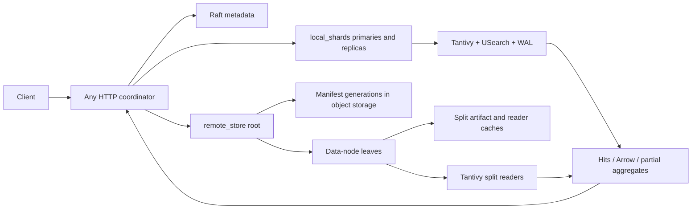

<p align="center">
  
</p>

# FerrisSearch

<p align="center">
  <strong>Search first. Analyze in place.</strong>
</p>

<p align="center">
  A distributed Rust search engine for full-text retrieval, search-aware SQL,
  vector search, and experimental object-store-native execution.
</p>

<p align="center">
  <a href="#five-minute-tour">Five-Minute Tour</a> ·
  <a href="#why-ferrissearch">Why FerrisSearch</a> ·
  <a href="#architecture">Architecture</a> ·
  <a href="#current-maturity">Maturity</a> ·
  <a href="#roadmap">Roadmap</a> ·
  <a href="#documentation">Docs</a>
</p>

---

FerrisSearch explores a simple systems idea:

> Keep text matching, structured filtering, fast-field reads, and eligible
> partial aggregation close to the search index. Move compact results—not every
> matching row—across the cluster.

It combines [Tantivy](https://github.com/quickwit-oss/tantivy),
[Arrow](https://arrow.apache.org/),
[DataFusion](https://datafusion.apache.org/),
[openraft](https://github.com/datafuselabs/openraft),
[USearch](https://github.com/unum-cloud/usearch), and
[tonic](https://github.com/hyperium/tonic) in one service binary with no JVM.

FerrisSearch is **pre-1.0**. It has substantial working code and broad automated
coverage, but it is not yet a production-safe drop-in replacement for
OpenSearch. The [maturity section](#current-maturity) names the important gaps.

## Why FerrisSearch

### Search-aware SQL

```sql
SELECT author, count(*) AS posts, avg(upvotes) AS avg_upvotes
FROM "hackernews"
WHERE text_match(title, 'rust')
GROUP BY author
HAVING posts > 5
ORDER BY avg_upvotes DESC
LIMIT 10;
```

Tantivy evaluates `text_match` and pushable filters. Eligible shards aggregate
directly from fast fields. The coordinator merges compact partial states,
applies final relational semantics, and reports how the query ran.

```json
{
  "execution_mode": "tantivy_grouped_partials",
  "streaming_used": false,
  "matched_hits": 12473,
  "truncated": false
}
```

DataFusion is the residual relational engine, not the text-search engine.
FerrisSearch keeps a materialized-hit path for compatibility shapes that cannot
yet stay columnar.

### One coordinator model

Any HTTP node can accept a request. FerrisSearch forwards leader-only metadata
mutations and shard-owned operations internally, so clients do not have to
discover the Raft leader or shard primary.

### Two useful execution paths—and one intended future

| Engine | What exists now | Write path | Query path |
|---|---|---|---|
| `local_shards` | Mutable Tantivy + USearch shards, WAL, routing, replica RPCs | Standard document and bulk APIs | Local/remote shard scatter-gather |
| `remote_store` | Shardless immutable split bundles and generation manifests in local or S3-compatible storage | Dedicated manual split publication API | Root/leaf pruning, assignment, hydration, cache, and merge |

The long-term architecture does not keep these as two independent products. It
turns mutable, near-real-time data into immutable object-store splits under one
version and snapshot model:

```text
durable mutable delta
  -> searchable refresh
  -> bounded split seal
  -> fenced manifest commit
  -> stateless query compute
  -> version-aware compaction
  -> snapshot-safe garbage collection
```

That lifecycle is the central 12-24 month roadmap, not a claim about the current
implementation.

## Five-Minute Tour

### Prerequisites

- A current stable Rust toolchain with Rust 2024 edition support
- `protoc`
- `curl`

### 1. Start a node

```bash
cargo run --release --bin ferrissearch
```

The REST API listens on `localhost:9200`; internal gRPC uses `localhost:9300`.

### 2. Create an index

```bash
curl -sS -X PUT 'http://localhost:9200/movies' \
  -H 'Content-Type: application/json' \
  --data-binary @- <<'JSON'
{
  "engine": "local_shards",
  "settings": {
    "number_of_shards": 1,
    "number_of_replicas": 0
  },
  "mappings": {
    "dynamic": "strict",
    "properties": {
      "title":  {"type": "text"},
      "genre":  {"type": "keyword"},
      "year":   {"type": "integer"},
      "rating": {"type": "float"}
    }
  }
}
JSON
```

### 3. Index a small batch

```bash
curl -sS -X POST 'http://localhost:9200/movies/_bulk?refresh=true' \
  -H 'Content-Type: application/x-ndjson' \
  --data-binary @- <<'NDJSON'
{"index":{"_id":"1"}}
{"title":"Rust Never Sleeps","genre":"documentary","year":2024,"rating":8.7}
{"index":{"_id":"2"}}
{"title":"Memory Safety","genre":"documentary","year":2025,"rating":9.1}
{"index":{"_id":"3"}}
{"title":"Borrowed Time","genre":"drama","year":2023,"rating":8.2}
NDJSON
```

### 4. Search

```bash
curl -sS -X POST 'http://localhost:9200/movies/_search?pretty' \
  -H 'Content-Type: application/json' \
  -d '{
    "query": {
      "bool": {
        "must": [{"match": {"title": "rust"}}],
        "filter": [{"range": {"rating": {"gte": 8.0}}}]
      }
    }
  }'
```

### 5. Analyze the matched set

```bash
curl -sS -X POST 'http://localhost:9200/movies/_sql?pretty' \
  -H 'Content-Type: application/json' \
  --data-binary @- <<'JSON'
{
  "query": "SELECT genre, count(*) AS films, avg(rating) AS avg_rating FROM movies WHERE text_match(title, 'rust') GROUP BY genre ORDER BY avg_rating DESC"
}
JSON
```

### SQL console

```bash
cargo run --release --bin ferris-cli
cargo run --release --bin ferris-cli -- -c 'SHOW TABLES'
```

The interactive console supports multiline SQL, persistent history, completion,
`\watch`, streamed NDJSON results, and EXPLAIN metadata.

### Three-node development cluster

```bash
./dev_cluster_release.sh --nodes 3
```

Or run the debug nodes in separate terminals:

```bash
./dev_cluster.sh 1
./dev_cluster.sh 2
./dev_cluster.sh 3
```

### Docker

```bash
docker build -t ferrissearch .
docker run --rm -p 9200:9200 -p 9300:9300 ferrissearch
```

## What Works Today

### Search and analytics

- Query DSL: `match`, `term`, `bool`, `range`, `wildcard`, `prefix`, `fuzzy`,
  and `match_all`
- Numeric/date sorting and `search_after` cursor pagination, with documented
  tie limitations
- Terms, stats, min, max, average, sum, value-count, and histogram aggregations;
  numeric terms preserve full signed-integer bucket identity
- Declared keyword fields support nested scalar arrays: values are flattened,
  coerced to text, deduplicated per document, and preserved unchanged in
  `_source`; object elements are rejected
- Search-aware SQL with `text_match`, structured filter pushdown, grouping,
  `HAVING`, sorting, limit/offset, residual expressions, and same-index
  uncorrelated `IN (SELECT key ...)` semijoins
- Local and distributed fast-field Arrow execution
- Compact grouped partial aggregation
- k-NN vector search and Reciprocal Rank Fusion hybrid text/vector queries on
  the local-shard engine

SQL responses expose the current execution path:

| Mode | Meaning |
|---|---|
| `count_star_fast` | Metadata-only unfiltered `count(*)` |
| `tantivy_fast_fields` | Explicit columns read from fast fields |
| `tantivy_grouped_partials` | Search-native shard-local partial aggregation |
| `materialized_hits_fallback` | Compatibility path for unsupported columnar shapes |

Keyword arrays are searchable and aggregate correctly through the Query DSL.
Direct SQL fast-field readers are still scalar-first; FerrisSearch does not yet
claim general SQL ARRAY values or `UNNEST` support.

`sql_approximate_top_k` currently defaults to `true`. Eligible grouped
`ORDER BY metric LIMIT N` queries may prune shard-local buckets approximately;
responses and EXPLAIN metadata disclose activation. Set it to `false` when exact
coordinator-side merge semantics are required.

### Distribution and durability

- Raft-backed cluster membership, leader election, index metadata, mappings,
  settings, and dynamic security metadata
- Primary/replica shard routing over gRPC
- Generation-based binary translog with request or asynchronous durability
- Primary write receipts propagated to REST `_seq_no` responses, including bulk
  ranges, with replica WAL sequence preservation
- Monotonic sequence high-watermark tracking
- Bounded file-based peer recovery for later-added/rejoining replicas:
  committed Tantivy files, pinned WAL suffix, final write barrier, and
  conditional in-sync admission
- UUID-backed shard data directories and process-backed restart regression
- Separate rayon pools for search and write engine work
- Blocking wrappers for filesystem/recovery work on async call paths

### Operations and security

- Index settings, refresh, flush, asynchronous shard-local force merge, and task status
- Cluster health/state and `_cat` node, index, shard, master, and segment views
- Prometheus metrics and `EXPLAIN ANALYZE`
- Optional HTTP API-key authentication with role/index authorization
- Runtime API-key and custom-role management through `/_security/*`
- Optional client HTTP TLS and inter-node transport TLS through Cargo features

Security is disabled by default. FerrisSearch stores API-key hashes, never
plaintext secrets; dynamically generated secrets are returned only once.

On Linux, `column_cache_size_percent` is applied to host physical memory capped
by visible finite cgroup v2 `memory.max` or cgroup v1
`memory.limit_in_bytes` values, including tighter visible ancestors. Startup
exports `ferrissearch_column_cache_effective_memory_bytes` and
`ferrissearch_column_cache_budget_bytes`. This is only the shared column-cache
capacity; it is not a total-process memory limit.

`max_concurrent_peer_recoveries` limits target-side recovery sessions per node
(default `2`, maximum `64`). Set it to `0`, or set
`FERRISSEARCH_MAX_CONCURRENT_PEER_RECOVERIES=0`, to keep assigned replicas
`INITIALIZING` without automatic recovery.

For `local_shards`, each encoded WAL operation is limited to 32 MiB, including
the frame header and internal `_doc_id` / `_source` wrapper. The maximum usable
JSON document body is therefore slightly smaller and varies with the document
ID and serialized shape. Oversized single or bulk items are rejected before
WAL mutation. Restart and replay retain bounded upgrade compatibility for
complete legacy frames up to 65 MiB; peer recovery may skip those frames when
they are already represented by the file snapshot, but transferred operations
remain limited to 32 MiB.

Force merge keeps its asynchronous `202 Accepted` task lifecycle. A valid
`max_num_segments` is at least 1; each shard drains already-scheduled automatic
Tantivy merges, performs the requested merge under shard-local maintenance
coordination, and then restores its automatic merge policy.

### Experimental remote-store reads

`remote_store` indices can:

- publish deterministic Tantivy split bundles;
- store manifests and bundles on local filesystems or S3/S3-compatible storage;
- prune splits conservatively from exact term sets and numeric/date ranges;
- assign batches to data-node leaves with rendezvous affinity and cache/load
  preference;
- hydrate and checksum node-local artifacts;
- reuse open readers; and
- report pruning counters in search and SQL analysis responses.

Standard `_doc`, `_bulk`, `_update`, and `_delete` APIs return `501` for this
engine. Data is currently added through:

```http
POST /{index}/_remote_store/publish
{"docs":[{"_id":"a","title":"..."},{"_id":"b","title":"..."}]}
```

See the [RustFS live runbook](docs/remote-store-rustfs-live-runbook.md) and
`scripts/remote_store_rustfs_smoke.sh` for the S3-compatible path.

## Architecture


```mermaid
flowchart LR
    C[Client] --> H[Any HTTP coordinator]
    H --> R[Raft metadata]
    H --> L[local_shards primaries and replicas]
    H --> Q[remote_store root]
    Q --> M[Manifest generations in object storage]
    Q --> N[Data-node leaves]
    N --> O[Split artifact and reader caches]
    L --> T[Tantivy + USearch + WAL]
    N --> S[Tantivy split readers]
    T --> A[Hits / Arrow / partial aggregates]
    S --> A
    A --> H
```

### Responsibility split

| Layer | Responsibility |
|---|---|
| Raft control plane | Cluster membership, master, index identity, routing, mappings, settings, security records |
| Mutable data plane | WAL, primary mutation, replica apply, refresh, local Tantivy/USearch |
| Immutable data plane | Split bundles, manifests, schema summaries, object storage |
| Query plane | Tantivy matching/fast fields/partials, root/leaf fan-out, Arrow transport, residual DataFusion |
| Maintenance plane | Flush, force merge, cache reaping; compaction and object GC are roadmap work |

Split inventories, query assignments, and cache state do not belong in Raft.

## Current Maturity

FerrisSearch is a strong prototype and research platform. It is **not yet
production ready**. The most important limits are:

- A primary can mutate before replica acknowledgement fails; write retry and
  acknowledgement semantics need a formal contract.
- `_seq_no` now reports the primary WAL assignment, but `_version` and
  `_primary_term` compatibility fields remain placeholders. Gap-aware
  checkpoints, primary epochs, idempotent retries, `if_seq_no` /
  `if_primary_term`, and complete optimistic concurrency control are still
  missing.
- Replica bootstrap needs snapshot-plus-streamed-WAL recovery.
- Remote manifest publication is serialized only inside one process; there is
  no cross-process compare-and-set or writer fencing.
- Remote-store ingest is manual, not near-real-time, and there is no unified
  update/delete, compaction, retention, or object-store GC lifecycle.
- Cold split hydration buffers full bundles, and cache/query/background work do
  not share one complete resource budget.
- End-to-end cancellation, deadline propagation, and admission control are
  incomplete.
- OpenSearch compatibility is a tested subset, not a drop-in contract.
- Security is API-key based and opt-in; there is no SSO/OIDC/LDAP layer.

These are ranked as engineering work, not hidden as caveats:
[The Next 50 Engineering Tasks](docs/next-50-tasks.md).

## API Surface

FerrisSearch intentionally exposes an OpenSearch-style REST API **subset**.

| Area | Representative endpoints |
|---|---|
| Index | `PUT /{index}`, `DELETE /{index}`, `GET/PUT /{index}/_settings` |
| Documents | `POST/PUT /{index}/_doc`, `GET/DELETE /{index}/_doc/{id}`, `POST /{index}/_update/{id}` |
| Bulk | `POST /_bulk`, `POST /{index}/_bulk` |
| Search | `GET/POST /{index}/_search`, `GET/POST /{index}/_count` |
| SQL | `POST /{index}/_sql`, `/_sql`, `/{index}/_sql/stream`, `/_sql/stream`, `/{index}/_sql/explain` |
| Catalog | `/_cat/nodes`, `/_cat/indices`, `/_cat/shards`, `/_cat/segments`, `/_cat/master` |
| Maintenance | `/{index}/_refresh`, `/{index}/_flush`, `/{index}/_forcemerge`, `/_tasks/{id}` |
| Security | `/_security/api_key`, `/_security/role/{name}` |
| Remote store | `/{index}/_remote_store/publish`, `/{index}/_remote_store/verify` |
| Observability | `/_cluster/health`, `/_cluster/state`, `/_metrics` |

Unsupported behavior should fail explicitly rather than return
shape-compatible false success.

## Benchmarks And Evidence

FerrisSearch includes ingestion, search, grouped SQL, NYC Taxi, and remote-store
scripts. Existing results are exploratory single-machine measurements—not
service-level promises or proof of production scale.

- [Benchmark notes and reproduction](docs/benchmarks.md)
- [Terms aggregation optimization benchmark](docs/terms-aggregation-benchmark-2026-09-22.md)
- [NYC Taxi hybrid benchmark](docs/nyc-taxi-hybrid-benchmark.md)
- [Remote-store pruning design and evidence](docs/remote-store-split-pruning.md)
- [EXPLAIN ANALYZE output design](docs/explain-analyze-output.md)

Performance contributions should include raw results, hardware, dataset,
topology, build flags, query text, cache state, correctness checks, and resource
cost. The roadmap treats reproducibility and ablation studies as part of the
systems-research contribution.

## Testing

```bash
./scripts/ci-local.sh

# Or run focused suites:
cargo test --lib
cargo test --bin ferris-cli
cargo test --test consensus_integration
cargo test --test replication_integration
cargo test --test rest_api_integration
cargo test --test restart_regression
cargo test --test sql_correctness
```

The repository includes unit, transport, multi-node REST, process-backed
restart, SQL logic, security, remote-store, and feature-gated TLS coverage.
S3-compatible tests require the documented external RustFS endpoint and report
as skipped when it is absent.

## Roadmap

FerrisSearch is aiming at an object-store-native search analytics system, not
maximum OpenSearch endpoint count.

1. Freeze write, manifest, snapshot, lifecycle, and format semantics.
2. Make writes, publication, recovery, cancellation, and admission trustworthy.
3. Converge mutable ingest and immutable splits.
4. Add versioned updates/deletes, compaction, retention, and GC.
5. Validate scale and the research hypotheses with reproducible evidence.

Read:

- [Strategic Architecture Roadmap](docs/architecture-roadmap.md) — target
  architecture, invariants, gates, research agenda, and V1 definition
- [Next 50 Engineering Tasks](docs/next-50-tasks.md) — ranked, dependency-aware
  work packages and completion evidence

## Documentation

| Document | Purpose |
|---|---|
| [Architecture roadmap](docs/architecture-roadmap.md) | Canonical future direction and release gates |
| [AI agent guide](docs/ai-agent-guide.md) | Context, planning, validation, and handoff rules for GPT/Claude/Copilot |
| [Remote-store live runbook](docs/remote-store-rustfs-live-runbook.md) | Shared S3-compatible storage validation |
| [Dynamic settings](docs/dynamic-settings.md) | Refresh and flush-threshold behavior |
| [Vector search](docs/vector-search.md) | Current vector architecture and examples |
| [Benchmarks](docs/benchmarks.md) | Historical measurements and reproduction notes |
| [Dependency review](docs/dependency-review-2026-09-22.md) | Point-in-time direct dependency assessment and deferred migrations |

`docs/architecture.md` and `docs/remote-store-one-pager.md` are historical
context; they do not override current source or the strategic roadmap.

## Contributing

Start with [AGENTS.md](AGENTS.md) for repository context and
[the next-50 backlog](docs/next-50-tasks.md) for priority. A strong change:

- advances one coherent outcome;
- protects the documented invariants;
- includes result-level and failure-path tests;
- reports focused validation; and
- keeps current capabilities distinct from roadmap targets.

## License

[Apache-2.0](LICENSE)
