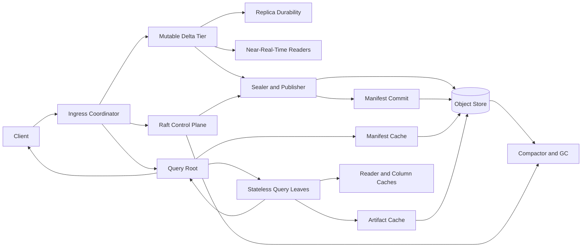

# FerrisSearch Strategic Architecture Roadmap

> - **Status:** Canonical architecture direction
> - **Revision:** 2026-07-10
> - **Horizon:** 12-24 months
> - **Current strategic gate:** Gate 0 - Architecture And Semantics Baseline
> - **Audience:** Maintainers, contributors, reviewers, and AI coding agents
> - **Scope:** Product direction, architecture, sequencing, release gates, and research agenda

This document is the guiding architecture plan for FerrisSearch. It is not a list of
independent feature requests. It defines the product FerrisSearch is trying to become,
the invariants that must survive every change, and the order in which major capabilities
should be built.

## Contents

1. [Authority And How To Read This Document](#1-authority-and-how-to-read-this-document)
2. [Executive Directive](#2-executive-directive)
3. [Product Thesis](#3-product-thesis)
4. [Current Source-Level Baseline](#4-current-source-level-baseline)
5. [Target Architecture](#5-target-architecture)
6. [Non-Negotiable Invariants](#6-non-negotiable-invariants)
7. [Core Architecture Decisions](#7-core-architecture-decisions)
8. [Priority Classes](#8-priority-classes)
9. [Roadmap Gates](#9-roadmap-gates)
10. [Workstream Plans](#10-workstream-plans)
11. [Research Agenda](#11-research-agenda)
12. [Success Metrics And Release Evidence](#12-success-metrics-and-release-evidence)
13. [Dependency Order](#13-dependency-order)
14. [Risk Register](#14-risk-register)
15. [Definition Of Production V1](#15-definition-of-production-v1)
16. [Immediate Work Packages](#16-immediate-work-packages)
17. [Operating Contract For Future AI Sessions](#17-operating-contract-for-future-ai-sessions)
18. [Source Evidence For This Roadmap](#18-source-evidence-for-this-roadmap)
19. [Final Decision Rule](#19-final-decision-rule)

## 1. Authority And How To Read This Document

Use these sources in this order:

1. **Source code and tests** describe current behavior.
2. **This roadmap** describes intended direction, priority, and sequencing.
3. Accepted architecture decision records describe deliberate deviations or refinements.
4. Focused design documents describe implementation slices within this roadmap.
5. The README summarizes shipped functionality and the tactical backlog.
6. Historical one-pagers and old status notes are context, not authority.

When code and this roadmap differ, do not silently change either one to match the other.
First determine whether the code is incomplete, the roadmap has been superseded by an
accepted decision, or the difference is an intentional compatibility constraint.

This roadmap should change only when the product direction, a core invariant, or milestone
ordering changes. Completing a small task should normally update the README or its focused
design document, not rewrite this strategy.

Strategic changes require an explicit decision record containing context, alternatives,
the chosen decision, consequences, migration impact, affected roadmap gates, and the
evidence that would invalidate the decision. Update the revision and current-gate metadata
only as part of such a reviewed change. A gate is complete only when all exit criteria have
durable test or operational evidence.

## 2. Executive Directive

FerrisSearch should become an **object-store-native distributed search and SQL system**
for text-heavy analytical workloads, with:

- Tantivy-native search, ranking, filtering, and fast-field execution
- compact shard/split-local partial aggregation
- DataFusion only for residual relational semantics
- immutable object-store splits as the durable scale-out query format
- stateless, cache-bearing query compute
- a mutable near-real-time ingest tier that seals data into immutable splits
- explicit execution metadata and reproducible performance evidence

FerrisSearch should **not** compete by maximizing the number of OpenSearch endpoints.
OpenSearch compatibility is an adoption surface, not the product thesis.

The long-term system must not remain two unrelated engines:

- `local_shards` is the current mutable, routed, replicated engine.
- `remote_store` is the current shardless, immutable, object-store read engine.
- The target is one lifecycle in which mutable local data becomes immutable remote data.

The intended lifecycle is:

```text
client operation
  -> durable mutable delta
  -> near-real-time searchable state
  -> sealed immutable split
  -> fenced manifest publication
  -> stateless remote serving
  -> version-aware compaction
  -> snapshot-safe garbage collection
```

Until that lifecycle exists, `remote_store` must remain explicitly read-only through the
normal document APIs. Do not add direct `_doc` or `_bulk` writes to `remote_store` as an
isolated shortcut.

## 3. Product Thesis

### 3.1 Primary Workload

The primary target is a durable search analytics system for:

- logs, events, traces, documents, feeds, and large append-heavy corpora
- combined full-text, structured filtering, grouping, sorting, and SQL projection
- datasets larger than the aggregate local SSD budget
- clusters where query compute can be added or removed independently of durable storage
- operators who need understandable query plans, costs, and failure behavior

The strongest differentiator is the combination of:

1. search-aware SQL planning
2. immutable object-store split execution
3. compact distributed partial aggregation
4. conservative metadata pruning
5. cache-aware stateless scheduling
6. transparent execution and cost reporting

### 3.2 Secondary Workload

`local_shards` should continue to support low-latency document CRUD and small deployments.
It is also the natural foundation for the future mutable ingest/delta tier. It should not
indefinitely define a separate consistency model from the object-store path.

### 3.3 Deployment Profiles To Preserve

The architecture should support clear profiles without changing data semantics:

- **single-node development:** local filesystem storage, one process, no external service
- **`local_shards` compatibility:** current routed mutable shards for small installations
- **unified object-store deployment:** target hot-delta plus immutable-split lifecycle
- **query-only compute:** stateless roots/leaves over already-published object-store data

The first two profiles exist today. The latter two are roadmap targets. Shared query,
version, and format contracts should prevent each profile from becoming a separate product.

### 3.4 Explicit Non-Goals For This Horizon

FerrisSearch is not trying to become:

- a complete OpenSearch or Elasticsearch reimplementation
- a general-purpose OLTP database
- a general distributed SQL warehouse
- a system that sends all matched rows to DataFusion by default
- a data plane whose split membership is replicated through Raft
- a platform with exact and approximate query behavior mixed without disclosure
- two independent storage engines with duplicated lifecycle, recovery, and API semantics

Cross-index joins, broad plugin compatibility, arbitrary scripting, and the full OpenSearch
administrative API should not displace correctness, recovery, and object-store lifecycle
work during this roadmap.

## 4. Current Source-Level Baseline

This section records the starting point. It is descriptive, not aspirational.

### 4.1 Reusable Strengths

| Area | Existing strength | Reuse in target architecture |
| --- | --- | --- |
| Search | Tantivy query building, typed terms, fast fields, sorting, aggregations | Per-delta and per-split execution |
| Hybrid SQL | Search-aware planner, Arrow bridge, grouped partials, residual DataFusion | Core research and product query path |
| Distribution | Coordinator-safe REST handling and gRPC fan-out | Ingress, root, and leaf transparency |
| Control plane | Raft-backed cluster metadata and membership | Index identity, schemas, roles, writer fencing, policy |
| Mutable durability | Generation-based WAL and explicit replica sequence application | Hot delta durability and replay |
| Immutable serving | Manifest generations, packed split bundles, root/leaf execution | Durable scale-out read plane |
| Caching | Column cache, split artifact cache, open reader cache | Unified resource-accounted cache hierarchy |
| Isolation | Dedicated search/write rayon pools and Tokio blocking wrappers | Foundation for workload classes and admission |
| Correctness tests | Unit, integration, restart, transport, REST, and sqllogictest suites | Release gates and fault testing |
| Operations | Metrics, TLS, security, task tracking, EXPLAIN metadata | Production diagnostics and governance |

### 4.2 `local_shards` Today

The mutable path routes a document to a primary shard, mutates the primary engine, and
then synchronously replicates the operation to replicas. Replicas preserve the primary's
sequence number.

Important limitations:

- a replication failure can be returned after the primary has already mutated
- client-visible version, sequence, and primary-term metadata is incomplete or synthetic
- `_update` is read-merge-write without optimistic concurrency control
- replica recovery is WAL-oriented rather than snapshot-plus-WAL
- recovery materializes operation collections that should eventually stream
- the global checkpoint is constrained by the slowest included replica
- ISR policy is fixed rather than driven by an explicit replication state machine
- Raft-replicated settings metadata does not yet notify every follower's already-open engines
- bulk request parsing and routing materialize the full request
- vector rebuild is capped and can hide recovery errors

These are correctness and operability issues, not merely compatibility gaps.

### 4.3 `remote_store` Today

The immutable path:

- creates shardless `remote_store` index metadata in Raft
- publishes packed Tantivy split bundles through `StorageManager`
- writes immutable manifest generations plus a mutable current pointer
- validates schema hashes
- records exact structured summaries for conservative split pruning
- asks data-node leaves for cache/load status
- assigns split batches with rendezvous affinity and cache/load preference
- hydrates artifacts into node-local caches
- reuses open `HotEngine` readers
- merges split-local search and aggregation results at the root

Important limitations:

- publication serialization is process-local; there is no cross-process compare-and-set
- there is no writer epoch or fencing token
- failure after bundle upload can leave unreferenced objects
- there is no complete split retention, compaction, and garbage-collection protocol
- normal near-real-time ingest, update, and delete semantics do not exist
- cold hydration buffers and unpacks whole bundles
- artifact and reader memory/disk pressure are not governed by one node budget
- leaf status is collected on the query path
- scheduling cost grows with split and leaf counts
- caches and load knowledge are node-local and reactive

### 4.4 Documentation Reality

Some historical documents describe pre-implementation `remote_store` status and object
layouts. Future work must inspect source before trusting status checklists. In particular,
root/leaf execution, packed bundles, cache hydration, reader reuse, and structured split
pruning already exist.

## 5. Target Architecture



### 5.1 Control Plane

Raft owns small, globally consistent metadata:

- index identity and schema
- immutable engine/lifecycle mode
- node membership and declared capabilities
- security configuration
- writer or compactor leases, epochs, and fencing state
- policy and configuration needed to interpret durable data

Raft must not own:

- the list of every immutable split
- query assignments
- cache inventory
- per-query load data
- large snapshots or data-plane payloads

### 5.2 Durable Data Plane

The durable data plane consists of:

- WAL and replicated mutable deltas that have not yet been sealed
- immutable, checksummed split artifacts
- immutable generation manifests
- one conditionally updated manifest pointer per index
- tombstone/version metadata needed to interpret updates and deletes

Object storage is the authority for published split inventory. Local caches are never
authoritative and must always be reconstructible.

### 5.3 Query Plane

Every HTTP node remains a coordinator. Internally:

- **ingress coordinator:** authenticates, authorizes, parses, and resolves the index
- **root:** pins a manifest snapshot, plans/prunes work, assigns batches, retries, and merges
- **leaf:** hydrates or opens splits and executes search/SQL partials
- **hot reader:** includes the current mutable delta when the requested consistency permits it

Roles are capabilities, not client-visible leaders. A node may implement multiple roles,
but protocols must not assume that every node always does so.

### 5.4 Maintenance Plane

Publication, compaction, repair, cache reaping, snapshotting, and garbage collection are
first-class scheduled workloads. They must have:

- explicit resource classes and concurrency limits
- cancellation and progress reporting
- durable ownership or retry semantics
- observability separate from foreground requests
- no ability to starve Raft heartbeats or ordinary query/write traffic

## 6. Non-Negotiable Invariants

Future changes must preserve these invariants.

### 6.1 Write And Version Invariants

1. An acknowledged write has one documented durability and visibility meaning.
2. A retry after an ambiguous response is safe through operation identity or OCC.
3. Replicas never invent sequence numbers for primary-originated operations.
4. `_seq_no`, `_primary_term`, and `_version` are real values or are omitted; they are never fabricated.
5. Updates and deletes have explicit conflict semantics.
6. Failover cannot acknowledge an operation from an obsolete primary epoch.

### 6.2 Manifest And Split Invariants

1. Published split artifacts are immutable.
2. A manifest generation is immutable after successful creation.
3. The current pointer advances only through an expected-generation check and a valid writer epoch.
4. Two publishers cannot lose each other's committed splits.
5. Readers pin one logical snapshot for the duration of a request.
6. A retry cannot count the same split twice.
7. Garbage collection never removes an object reachable from a retained or in-flight snapshot.
8. An upload is not visible until its checksum and manifest commit succeed.

### 6.3 Query Invariants

1. Conservative pruning may keep extra splits but may never drop a possible match.
2. Exact execution is the default.
3. Approximation requires an explicit setting and response/EXPLAIN disclosure.
4. Distributed results must match a single-node oracle for the same snapshot.
5. Text matching remains in Tantivy; DataFusion does not become the default search engine.
6. Compact partial states are preferred over shipping matched rows.
7. Cancellation and deadlines propagate through coordinator, root, leaves, storage, and workers.

### 6.4 Resource Invariants

1. Every untrusted or data-sized input has a configurable bound or streaming path.
2. Cache, hydration, query, ingest, and maintenance memory are accounted against node budgets.
3. Disk cache eviction cannot remove pinned readers.
4. Blocking filesystem, Tantivy, object-store, and database work does not run inline on Tokio workers.
5. Background work yields to foreground service according to explicit policy.
6. Overload is rejected or queued deliberately; it is not converted into uncontrolled memory growth.

### 6.5 Control-Plane Invariants

1. Cluster-state mutations go through Raft.
2. Data-plane inventory does not grow the Raft log or snapshots without a compelling, reviewed reason.
3. Clients can send requests to any node.
4. Followers forward leader-owned operations rather than returning redirection errors.
5. Unknown protocol data and corrupt durable data fail loudly.
6. Snapshot, manifest, bundle, WAL, and wire versions are explicit; unknown versions are
   rejected rather than coerced into defaults.

## 7. Core Architecture Decisions

These decisions guide implementation unless deliberately superseded.

### 7.1 One Product Lifecycle, Not Two Engines

`local_shards` becomes the mutable/hot portion of a lifecycle that seals into
`remote_store` splits. It may remain deployable on its own for small clusters, but shared
write identity, versioning, query semantics, and recovery rules should prevent divergence.

### 7.2 Single Sequencer, Parallel Producers

The first production publication model should allow parallel split construction but only
one fenced manifest sequencer per index.

The commit protocol should be:

1. acquire or renew a Raft-issued writer epoch
2. build the split in a private staging location
3. stream-upload an immutable artifact while computing checksum and size
4. verify the artifact metadata
5. write an immutable manifest generation with parent generation and writer epoch
6. compare-and-set the current pointer against the expected parent and epoch
7. report the split as visible only after pointer advancement
8. leave failed staged artifacts discoverable to the janitor

True multi-writer manifest merging should not be attempted before this simpler protocol
is proven. Parallel producers can hand completed split descriptors to the sequencer.

### 7.3 Snapshot-Oriented Reads

A query should resolve a read snapshot containing:

- index UUID and schema generation
- immutable manifest generation
- optional committed hot-delta watermark
- delete/version visibility watermark

Retries and leaf reassignments must keep that snapshot stable.

### 7.4 Delta-Based Near-Real-Time Ingest

Near-real-time behavior should come from a bounded mutable delta tier, not from publishing
a complete remote split per document.

The delta tier should:

- preserve primary-assigned operation order
- expose refresh semantics
- support idempotent replay
- seal by time, bytes, document count, or operational pressure
- publish asynchronously without losing acknowledged data
- remain queryable until the corresponding split is committed and visible

### 7.5 Versioned Updates And Deletes

The long-term logical record model is keyed by document ID and ordered by a real operation
version. Updates append a newer version; deletes append a tombstone. Query visibility
chooses the newest operation at or below the snapshot watermark.

Compaction may physically remove superseded versions only when retained snapshots and
recovery policy permit it.

### 7.6 Snapshot Plus WAL Recovery

WAL-only recovery is not sufficient at scale. A recovering local replica should:

1. install or reuse a verified shard snapshot
2. identify its snapshot checkpoint
3. stream only the WAL suffix after that checkpoint
4. preserve primary sequence numbers
5. verify final checkpoint continuity before entering ISR

The object-store split plane should use manifest/split repair rather than document replay.

### 7.7 Cached Scheduling State

Root scheduling should not require a full leaf-status round trip on every query.

Move toward:

- periodic or piggybacked leaf load and cache-inventory summaries
- short-lived root-side scheduling snapshots
- stable rendezvous affinity
- cache and load preference inside a bounded candidate window
- per-request unhealthy-node suppression
- batched split assignments
- explicit retry budgets and deadlines

### 7.8 Unified Resource Governance

Search, ingest, hydration, compaction, recovery, and maintenance need one admission model.
Thread pools alone are not admission control.

The model should include:

- per-class concurrency permits
- byte-based memory and in-flight I/O reservations
- queue limits and rejection behavior
- request deadlines and cancellation tokens
- foreground/background priority
- per-index or per-tenant quotas when multi-tenancy is enabled
- metrics for queued, admitted, rejected, cancelled, and over-budget work

### 7.9 Targeted Compatibility

FerrisSearch should maintain a machine-readable compatibility matrix with four states:

- compatible
- compatible with documented differences
- implemented but experimental
- unsupported

Unsupported behavior should return explicit errors. The project should not claim broad
OpenSearch compatibility while returning synthetic metadata or silently accepting
different semantics.

### 7.10 Migration Without Semantic Reinterpretation

`IndexSettings.engine` is immutable today. Convergence must not silently reinterpret an
existing `local_shards` or `remote_store` index.

Gate 0 must decide how the unified lifecycle is represented. Whether it becomes a new
engine/lifecycle mode or an explicitly versioned setting, the migration rules are:

- existing index metadata keeps its original meaning
- enabling the unified lifecycle is an explicit operator action
- old data is verified and copied/reindexed into a new index UUID or an equally safe
  versioned migration target
- cutover is atomic from the client's perspective
- rollback keeps the previous readable generation until the retention window closes
- unsupported in-place type or format changes are rejected
- deprecation of a legacy profile requires a documented migration tool and compatibility
  window

Until safe alias-assisted cutover exists, migration may require an explicit new index and
client cutover. Convenience must not replace recoverability.

## 8. Priority Classes

### 8.1 Release Blocker

A release blocker can cause acknowledged-data loss, stale-primary acceptance, lost
publication, incorrect results, destructive cleanup, unbounded resource use, or an API
claim that misrepresents actual semantics.

Current release-blocker themes:

- write acknowledgement and versioning contract
- manifest fencing and atomic pointer advancement
- snapshot-safe split lifecycle and GC
- recovery beyond unbounded WAL replay
- cancellation, deadlines, and admission
- vector recovery completeness and error propagation
- explicit compatibility claims

### 8.2 Scale Blocker

A scale blocker is correct at small scale but grows unacceptably with documents, splits,
nodes, bytes, groups, or concurrent requests.

Current scale-blocker themes:

- whole-request bulk parsing
- whole-bundle cold hydration and unpacking
- separate cache budgets without total node accounting
- per-query leaf status fan-out
- split-by-leaf scheduling complexity
- large recovery materialization
- slow-replica checkpoint coupling
- unbounded or weakly bounded high-cardinality work

### 8.3 Research Opportunity

A research opportunity should improve a measurable systems tradeoff and have a credible
baseline. It must not bypass release invariants.

Current opportunities:

- cost-based split pruning and plan selection
- adaptive cache-aware scheduling under elasticity
- compact distributed aggregation over search matches
- exact/approximate top-K policy with quality bounds
- unified hot-delta and immutable-split query planning
- transparent attribution of planning, I/O, cache, search, and merge cost

## 9. Roadmap Gates

Calendar ranges are planning guidance. Gates are mandatory and must not be skipped because
a date has passed.

### Gate 0: Architecture And Semantics Baseline (0-2 Months)

**Goal:** Make the intended system contract explicit before expanding functionality.

Deliverables:

- accepted write acknowledgement, retry, OCC, and version semantics
- accepted manifest writer-epoch and pointer-CAS protocol
- accepted read-snapshot model
- explicit relationship between hot deltas and immutable splits
- explicit lifecycle-mode and existing-index migration contract
- logical schema generation and durable-format compatibility contract
- compatibility matrix replacing blanket compatibility claims
- baseline failure matrix for local writes and remote publication
- baseline benchmark harness with reproducible hardware/configuration metadata
- documentation precedence and stale-document cleanup

Exit criteria:

- every client-visible write outcome has defined retry behavior
- every durable object has an owner, reachability rule, and cleanup rule
- the target state can be explained without treating `local_shards` and `remote_store` as independent products
- open design questions are recorded as decision records, not left to implementation guesses

### Gate 1: Correctness And Production Preview (2-6 Months)

**Goal:** Remove the most serious correctness and unbounded-resource hazards.

Deliverables:

- real sequence/version/primary epoch propagation to APIs
- OCC for index, update, and delete operations
- idempotent operation identity for ambiguous retries
- fenced single-sequencer manifest publication
- concurrent-publisher and crash-point publication tests
- staged-object inventory and conservative orphan janitor
- snapshot bootstrap plus streamed WAL suffix recovery
- complete vector recovery with no fixed document cap or swallowed error
- request cancellation and deadline propagation through internal RPCs
- initial admission permits and byte budgets
- streaming bulk parser with item-level malformed-input reporting

Exit criteria:

- no acknowledged operation is lost in the supported failover matrix
- stale primaries and stale publishers are fenced
- concurrent publication cannot lose a committed split
- cancelled work releases permits and pins within a bounded interval
- malformed bulk actions are reported rather than silently skipped
- restart, rejoin, and publication crash tests run in CI or a documented required release suite

### Gate 2: Unified Near-Real-Time Object-Store Beta (6-12 Months)

**Goal:** Connect mutable ingest to immutable remote serving.

Deliverables:

- bounded hot-delta abstraction built on proven local durability primitives
- automatic sealing and split construction
- asynchronous publication with visibility watermark
- query snapshots spanning committed hot data and immutable splits
- version/tombstone semantics across delta and split boundaries
- first compaction planner and executor
- snapshot-safe retention and garbage collection
- explicit publisher, compactor, root, and leaf capabilities
- stateless leaf replacement with cache reconstruction
- backup/snapshot and restore of logical index state

Exit criteria:

- normal ingest becomes visible without the manual publish endpoint
- a document updated before and after sealing has one correct visible version
- deletes remain correct across restart, compaction, and cache loss
- query results are stable across leaf retry for a pinned snapshot
- losing all leaf caches affects latency, not correctness
- compaction and GC pass fault-injection tests at every commit boundary

### Gate 3: Scale, Isolation, And Efficiency (12-18 Months)

**Goal:** Make the architecture economical and predictable under sustained load.

Deliverables:

- streaming split hydration with checksum-on-write and atomic finalization
- range-oriented or component-oriented fetch where measurement justifies it
- unified memory/disk/cache accounting
- maintained leaf inventory and load snapshots outside the critical query path
- scheduler complexity bounded for large split/node counts
- cost-aware admission and queueing by workload class
- foreground/background CPU and I/O isolation
- streaming recovery and export paths
- configurable replica lag, removal, and repair policies
- multi-tenant quotas if multi-tenancy is declared supported
- long-running mixed ingest/query/compaction soak suite

Exit criteria:

- memory and disk usage remain within configured budgets under cold-cache fan-out
- adding splits does not linearly increase control RPCs per query
- compaction and recovery cannot starve ordinary requests
- overload produces observable queueing/rejection instead of process instability
- performance reports include cold/warm cache, concurrency, tail latency, and resource cost

### Gate 4: Research Validation And Production V1 (18-24 Months)

**Goal:** Turn the architecture into a credible open-source product and research result.

Deliverables:

- adaptive cost model for pruning, assignment, and execution mode
- exact default plus measured approximate modes
- reproducible benchmark suite against relevant open-source baselines
- ablation studies for pruning, scheduling, cache tiers, and partial aggregation
- published compatibility report
- operator runbooks for backup, restore, rolling change, repair, and capacity planning
- stable on-disk/wire migration policy
- documented SLO envelope for supported deployment profiles
- research paper, technical report, or equivalent rigorous artifact

Exit criteria:

- benchmark claims reproduce from a clean environment
- correctness suites compare distributed results with a single-node oracle
- chaos and soak results are published with limitations
- the system has a clear supported workload envelope and explicit non-goals
- the research claim remains meaningful after removing each major optimization in ablation

## 10. Workstream Plans

### 10.1 Consistency, Replication, And Versioning

Required work:

- define primary epoch and operation version types
- carry them through WAL entries, replica RPCs, recovery, and HTTP responses
- define success, conflict, timeout, and ambiguous-outcome behavior
- add idempotency or operation IDs for safe retry
- replace read-merge-write update with conditional mutation
- separate replica inclusion, lag detection, and repair from a fixed numeric ISR threshold
- define quorum/all-replica acknowledgement modes rather than accidental behavior
- prevent stale-primary writes after leadership or routing changes

Tests:

- primary mutation followed by replica failure
- client timeout after commit and safe retry
- concurrent updates with one expected conflict
- delete/update races
- stale primary and stale replica
- failover at every WAL/engine/replication acknowledgement boundary
- sequence continuity through snapshot restore and WAL suffix replay

### 10.2 Manifest Publication And Multi-Writer Safety

Required work:

- add parent generation, writer epoch, and publication operation ID
- expose conditional pointer update as a storage capability
- fail startup or publication clearly when a backend cannot provide required semantics
- separate staging, uploaded, committed, and reclaimable states
- make retries idempotent
- retain enough history for active readers and rollback diagnosis
- produce publication metrics and an inspectable audit trail

Tests:

- two processes publish from the same parent
- publisher loses lease before pointer update
- crash after upload, manifest write, and pointer update
- duplicate operation retry
- stale pointer cache
- eventual retry after transient object-store failure
- filesystem and S3-compatible backends exercising equivalent logical semantics

### 10.3 Split Lifecycle, Compaction, And Garbage Collection

Required work:

- model split lineage and replacement
- define compaction selection by size, age, overlap, deletes, and query cost
- prevent concurrent compactors from replacing the same input set
- retain old generations for a defined grace/snapshot period
- perform mark-and-sweep from retained manifests
- separate orphaned staging objects from previously published but no-longer-live objects
- make GC dry-run and explainable
- bound delete rate and object-store request rate

Tests:

- compaction crash before and after commit
- concurrent compaction attempts
- readers pinned to an old generation
- delayed/retried leaf request during GC
- tombstones spanning compacted and uncompacted splits
- restore from a retained generation
- false-positive prevention in orphan cleanup

### 10.4 Near-Real-Time Ingest, Updates, And Deletes

Required work:

- establish the document identity/version model first
- make the hot delta searchable under explicit refresh semantics
- define seal triggers and backpressure
- keep the delta visible until split publication is committed
- query hot and immutable layers without double-counting
- lower tombstones/version filters efficiently
- compact superseded versions without violating snapshots
- provide ingest lag, seal lag, and publish lag metrics

Do not:

- publish one split per document
- add normal `remote_store` writes before duplicate suppression exists
- rely on wall-clock time as the sole ordering/version source
- hide eventual visibility behind OpenSearch-shaped success responses

### 10.5 Root/Leaf Protocol And Stateless Compute

Required work:

- make the pinned snapshot explicit in root-to-leaf requests
- assign batches, not individual split RPCs
- include assignment/request IDs for deduplication
- define retryable versus terminal leaf errors
- propagate deadlines and cancellation
- avoid returning partial success as complete success unless the API explicitly allows it
- cache short-lived leaf capability/load state
- bound candidate ranking work
- expose assignment, retry, cache, and byte counters in EXPLAIN ANALYZE

Tests:

- leaf failure before work, during hydration, and after response transmission
- duplicate response/retry
- root cancellation
- manifest changes while a query is running
- node joins/leaves during scheduling
- one hot leaf and many cold leaves
- master-only coordinator with data-node leaves

### 10.6 Cache Hydration And Resource Accounting

Required work:

- stream object data to a temporary file
- checksum while streaming
- atomically mark a complete artifact
- remove incomplete artifacts after failure
- unify artifact, reader, column, query, and hydration accounting
- preserve reader pins across eviction decisions
- expose cache inventory without scanning the full filesystem per query
- distinguish cache admission from cache replacement
- protect against one very large split consuming the node

Metrics:

- logical and physical cache bytes
- pinned bytes
- hydration bytes and duration
- checksum failures
- hit/miss by cache tier
- admission rejection and eviction reason
- duplicate download suppression
- decompression CPU and temporary disk bytes

### 10.7 Cancellation, Deadlines, Admission, And Workload Isolation

Required work:

- create a request-scoped cancellation token
- propagate absolute deadlines over gRPC
- check cancellation in collectors, streaming loops, hydration, and merge stages
- add bounded admission queues
- reserve memory and in-flight bytes before large work begins
- classify foreground search, write, recovery, hydration, compaction, and maintenance
- expose queue time separately from execution time
- reject overload with stable, documented errors

Success is not "there is a timeout on the tonic endpoint." Success is that timed-out or
disconnected work stops consuming meaningful resources across the full distributed path.

### 10.8 Hybrid SQL And Search Execution

Preserve the existing responsibility split:

- Tantivy performs text matching, ranking, pushed filters, fast-field reads, and partials.
- Arrow carries columnar batches and partial states.
- DataFusion performs residual relational semantics.

Priorities:

- correctness and type stability across local and remote boundaries
- exact distributed merge
- execution eligibility reasons
- bounded high-cardinality behavior
- streaming only where it reduces retained memory
- reusable partial formats across hot deltas and immutable splits
- query snapshots shared by DSL search and SQL

Avoid expanding SQL syntax faster than execution invariants, distributed correctness, and
sqllogictest coverage can support.

### 10.9 Vector Search

Before expanding vector features:

- remove fixed-size rebuild assumptions
- surface rebuild errors
- define vector update/delete/version behavior
- preserve vector state through snapshot and split lifecycle
- establish whether vectors are embedded in immutable split artifacts or maintained as a
  separately versioned component
- add filtered and hybrid distributed correctness tests

Remote vector search should not ship as a disconnected reader-only feature without a
defined ingest, update, compaction, and cache format.

### 10.10 Compatibility

Required work:

- inventory every advertised endpoint and response field
- add conformance tests for supported behavior
- document semantic differences
- prefer explicit unsupported errors over shape-compatible false success
- ensure `refresh`, versioning, conflict, bulk item, and partial-failure semantics agree
- version wire and durable formats independently of OpenSearch API compatibility

Compatibility work is release-critical when FerrisSearch already claims behavior. New API
breadth is lower priority than making existing claims true.

### 10.11 Observability, Testing, And Operations

Every distributed stage needs:

- stable request and operation IDs
- structured error classes
- queue, execution, retry, and cancellation timings
- byte and row/document counters
- cache and object-store attribution
- saturation metrics
- tracing across coordinator, root, leaf, and storage operations

Required test layers:

1. pure state-machine and encoding tests
2. property tests for version and manifest transitions
3. direct transport tests
4. multi-node coordinator tests
5. process-backed crash/restart tests
6. object-store compatibility tests
7. deterministic failure-injection tests
8. long-running mixed-workload soak tests
9. single-node oracle comparison
10. reproducible performance and cost benchmarks

### 10.12 Schema Evolution And Format Migration

Immutable splits and dynamic mappings require explicit schema generations.

Required work:

- version the logical schema independently from the manifest generation
- record the schema generation and physical format version for every split
- define additive-field behavior for old splits where a field is absent
- keep unquoted SQL identifier canonicalization stable across schema generations
- reject in-place field-type changes that cannot be read safely
- make readers declare supported manifest, bundle, and partial-state versions
- provide rewrite/compaction migration for old physical formats
- preserve a rollback-readable generation during upgrades
- test mixed-version roots, leaves, and splits within the declared compatibility window

The current schema hash is a useful fail-closed guard, but the target cannot assume every
historical split was built from one permanently frozen schema. Compatibility must be
explicit rather than weakened into hash bypasses or silent coercion.

### 10.13 Security And Tenant Isolation

Security remains a cross-cutting production requirement:

- authenticate and authorize at ingress before body-routed work is scheduled
- preserve principal/index context in audit and admission decisions
- use transport identity and TLS for internal node trust
- keep object-store credentials out of Raft, manifests, logs, and API responses
- audit writer-lease, publication, compaction, restore, and security-control mutations
- introduce tenant quotas only after resource accounting can enforce them
- prevent one tenant or index from exhausting cache, hydration, query, or maintenance
  budgets assigned to others

Internal trust must not become a reason to skip validation of index UUIDs, schema versions,
checksums, writer epochs, or request bounds.

## 11. Research Agenda

The research contribution must be framed as testable systems claims.

### Hypothesis A: Search-Aware Split Pruning

Rich but compact split summaries can reduce object reads and leaf work while preserving
exact results.

Measure:

- candidate fraction
- object bytes avoided
- planning overhead
- p50/p95/p99 latency
- manifest size
- false-positive rate

Ablate:

- no pruning
- range summaries only
- term summaries only
- combined summaries
- alternative summary budgets

### Hypothesis B: Cache-Aware Rendezvous Scheduling

Stable affinity plus bounded cache/load awareness can outperform pure hashing and pure
least-loaded assignment under node churn and skew.

Measure:

- cache hit rate
- bytes downloaded
- tail latency
- load imbalance
- assignment overhead
- remapping under join/leave

Ablate:

- random
- pure rendezvous
- pure least-loaded
- cache-only
- cache plus load inside top-K rendezvous candidates

### Hypothesis C: Search-Native Partial Aggregation

Producing compact partial states where text matching occurs can reduce network and memory
relative to shipping matched rows into a general SQL engine.

Measure:

- bytes transferred
- peak memory
- CPU by stage
- total and tail latency
- group cardinality sensitivity
- selectivity sensitivity

Ablate:

- materialized hits
- Arrow row batches
- exact grouped partials
- approximate top-K partials

### Hypothesis D: Unified Hot And Immutable Planning

A query planner can combine a small mutable delta with many immutable object-store splits
without duplicate visibility or excessive coordination.

Measure:

- ingest-to-visible latency
- query overhead from the hot layer
- seal/publish lag
- duplicate suppression cost
- update/delete cost
- compaction amplification

### Research Integrity Rules

- publish configurations, datasets, queries, code revisions, and raw results
- include cold-cache and warm-cache measurements
- include concurrency and tail latency
- compare equal durability and correctness settings
- report negative results and unsupported cases
- never use approximate results as an exact baseline
- separate product defaults from experimental modes

## 12. Success Metrics And Release Evidence

Exact numeric SLOs should be set after Gate 0 baselines, but every release candidate must
report:

### Correctness

- acknowledged-write survival across the supported fault matrix
- distributed-versus-oracle query equivalence
- manifest linearizability under concurrent publication
- update/delete correctness across sealing and compaction
- no referenced-object deletion in GC fault tests

### Reliability

- recovery time by shard/split size
- repair bandwidth and retry counts
- 24-hour and 72-hour mixed-workload soak results
- cancellation cleanup latency
- cache-loss and node-loss behavior

### Scalability

- throughput and p50/p95/p99 versus documents, splits, nodes, and concurrency
- root planning time
- control RPCs per query
- bytes read from object store
- peak memory and disk cache usage
- compaction and recovery interference with foreground traffic

### Operability

- saturation and rejection visibility
- actionable error reporting
- backup/restore validation
- upgrade and migration validation
- supported configuration envelope

### Compatibility

- passed/failed compatibility matrix
- known semantic differences
- response-field fidelity
- unsupported behavior count

## 13. Dependency Order

| Capability | Must exist first |
| --- | --- |
| Real update/delete semantics | Operation identity, version, and primary epoch |
| Safe direct remote ingest | Hot delta, duplicate suppression, fenced publication |
| Concurrent split production | Single fenced manifest sequencer |
| Garbage collection | Snapshot retention and reachability model |
| Compaction | Version/tombstone model and fenced replacement commit |
| Stateless leaves | Durable split authority and reconstructible caches |
| Adaptive scheduling | Stable metrics, bounded inventory, cancellation |
| Approximate top-K defaults | Quality evaluation, disclosure, exact fallback |
| Remote vector search | Versioned vector lifecycle and split format |
| Multi-tenancy | Admission accounting, quotas, and auditability |
| Broad compatibility claim | Conformance matrix and real metadata semantics |
| Unified lifecycle migration | Explicit lifecycle mode, format versions, and rollback |
| Additive schema evolution | Schema generations and mixed-split read rules |

Do not implement a dependent capability by inventing a local shortcut around its
prerequisite.

## 14. Risk Register

| Risk | Impact | Mitigation |
| --- | --- | --- |
| Dual-engine divergence | Duplicated semantics and maintenance | Enforce one ingest-to-split lifecycle |
| Scope dilution through API breadth | Core correctness remains unfinished | Gate compatibility work through the matrix |
| Object-store CAS portability | Unsafe or backend-specific publication | Explicit storage capability and fail-closed behavior |
| Compaction debt | Read amplification and permanent tombstone cost | Build lifecycle before broad ingest |
| Cache thrash | Tail-latency and cost collapse | Unified budgets, admission, and stable affinity |
| Raft over-coupling | Large state, slow snapshots, control-plane instability | Keep split/query/cache inventory out of Raft |
| Hidden background work | Foreground latency spikes | Resource classes, quotas, and stage metrics |
| Misleading benchmarks | Weak product and research credibility | Reproducible baselines, ablations, raw results |
| Silent compatibility differences | User data or retry errors | Conformance tests and explicit unsupported responses |
| Single-maintainer complexity | Unreviewable subsystems | Narrow interfaces, decision records, focused milestones |

## 15. Definition Of Production V1

FerrisSearch V1 is ready when:

- its supported write semantics are explicit and fault-tested
- a supported index can ingest near-real-time data and seal it into object-store splits
- updates and deletes remain correct across restart, sealing, compaction, and GC
- manifests are fenced and linearizable under the supported publisher model
- query compute can be replaced without durable data movement
- cancellation, deadlines, and admission bound distributed work
- backup, restore, repair, and rolling operation have runbooks
- exact query results pass distributed oracle tests
- compatibility claims are backed by a published matrix
- performance claims are reproducible and include resource cost
- experimental approximate behavior is opt-in and disclosed

V1 does not require complete OpenSearch compatibility, arbitrary distributed joins, or
every planned vector and SQL feature.

## 16. Immediate Work Packages

The maintained, dependency-aware expansion of this list is
[`next-50-tasks.md`](next-50-tasks.md). The ranks and stable task IDs there
should drive issue creation and future session plans.

The first implementation issues should be created in this order:

1. Write consistency and retry contract decision record
2. Manifest writer epoch and compare-and-set decision record
3. Read snapshot and retention decision record
4. Unified lifecycle representation and existing-index migration decision record
5. Schema generation and durable-format compatibility decision record
6. Real version/sequence/primary epoch response plumbing
7. OCC for update and delete
8. Concurrent publication and crash-point test harness
9. Fenced single-sequencer manifest commit
10. Snapshot bootstrap plus streamed WAL recovery design
11. Cancellation/deadline propagation foundation
12. Admission and byte-reservation foundation
13. Streaming, strict bulk parser
14. Split reachability inventory and dry-run janitor
15. Unbounded vector rebuild with explicit failures
16. Reproducible failure and benchmark matrix
17. Documentation status cleanup and compatibility matrix

Large NRT, compaction, or remote vector changes should wait until these foundations exist.

## 17. Operating Contract For Future AI Sessions

Any GPT, Claude, or other AI session working on architecture, storage, replication,
remote execution, SQL planning, resource management, compatibility, or roadmap work must:

1. Read this document before proposing or editing code.
2. Inspect current source and tests; never infer current status from a checklist alone.
3. Identify the roadmap gate and workstream the task advances.
4. State which invariants the change touches.
5. Check the dependency table before introducing a new capability.
6. Prefer completing a release blocker over an unrelated tactical feature.
7. Reject shortcuts that create a second consistency or lifecycle model.
8. Add failure-path tests, not only happy-path tests.
9. Add observability for new distributed or background work.
10. Update focused docs when behavior changes and this roadmap only when strategy changes.

Use this alignment block in plans for substantial changes:

```text
Roadmap alignment
- Gate:
- Workstream:
- Release/scale/research class:
- Invariants affected:
- Prerequisites:
- Source evidence:
- Acceptance tests:
- Operational signals:
```

AI sessions must not:

- mark a roadmap gate complete because one code path exists
- describe planned behavior as shipped
- treat historical one-pagers as newer than source
- add fake compatibility metadata
- add broad catch/fallback behavior that hides corruption or protocol mismatch
- put split inventory or query scheduling state into Raft by convenience
- add an unbounded buffer where a stream or reservation is required
- enable approximation without explicit configuration and response metadata
- add direct `remote_store` CRUD before the hot-delta/version lifecycle is designed
- optimize away correctness checks without benchmark and fault evidence

If a user request conflicts with this roadmap, the session should explain the conflict and
ask whether the roadmap itself is being intentionally changed. It should not silently
reinterpret the strategy.

## 18. Source Evidence For This Roadmap

Key current seams to inspect before implementation:

- `src/api/index/mod.rs`
  - engine routing, `_update`, remote publish, search entry points
- `src/api/index/bulk.rs`
  - bulk parsing and synthetic response metadata
- `src/api/search/mod.rs`
  - local/remote query dispatch, SQL execution, and result coordination
- `src/transport/server/mod.rs`
  - primary write then replica acknowledgement, recovery, checkpoints, leaf RPCs
- `src/transport/client.rs`
  - forwarding, timeouts, remote leaf calls, response propagation
- `src/engine/composite.rs`
  - mutable text/vector integration, refresh, flush, vector rebuild
- `src/engine/tantivy.rs`
  - typed query execution, fast fields, grouped partials, streaming SQL
- `src/engine/remote_store.rs`
  - pruning, leaf status collection, assignment, retries, reader cache, publication
- `src/storage/mod.rs`
  - manifest pointer/generations, process-local publish lock, bundles, hydration, reaping
- `src/wal/mod.rs`
  - sequence ownership, generation manifests, replay, truncation
- `src/shard/mod.rs`
  - shard lifecycle, ISR tracking, UUID-backed data
- `src/replication/mod.rs`
  - synchronous primary-to-replica fan-out
- `src/consensus/`
  - Raft control-plane state and durable log
- `src/hybrid/`
  - search-aware SQL planning and distributed execution
- `proto/transport.proto`
  - internal protocol and metadata boundaries

## 19. Final Decision Rule

When priorities compete, choose in this order:

1. correctness and data safety
2. bounded failure and recovery
3. explicit resource governance
4. lifecycle completeness
5. distributed scalability
6. measurable research differentiation
7. compatibility breadth
8. convenience features

FerrisSearch succeeds by being a trustworthy, explainable, object-store-native search
analytics system. It does not succeed by accumulating the largest unchecked feature list.
