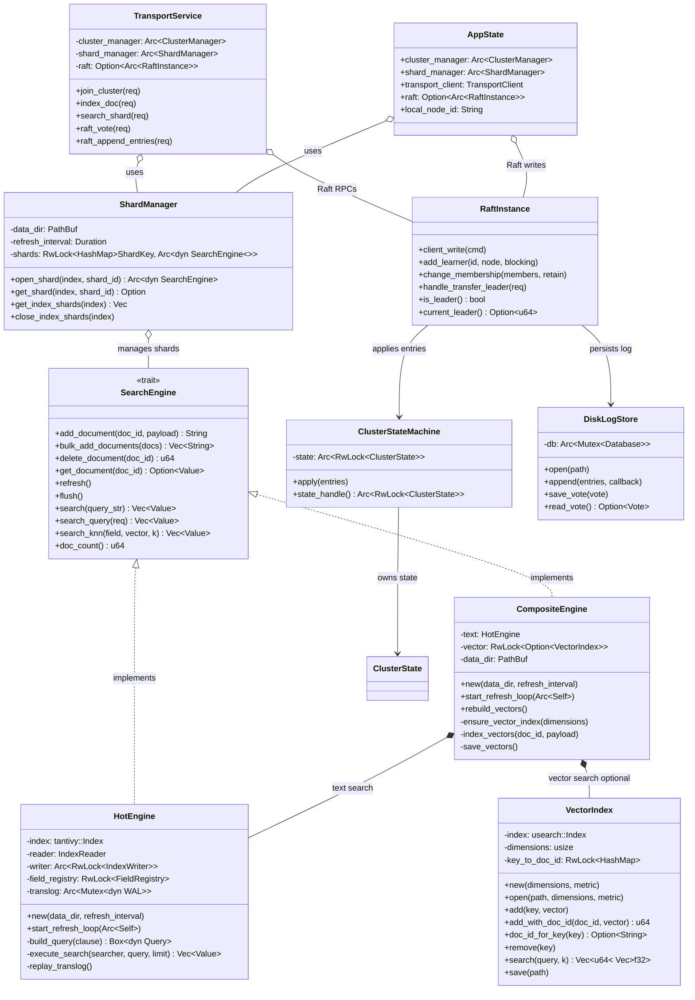

# FerrisSearch Architecture



## Data Flow

### Document Indexing
```
Client → HTTP API → Shard Routing → TransportService.index_doc()
                                         ↓
                                    CompositeEngine.add_document()
                                         ↓
                              ┌──────────┴──────────┐
                              ↓                     ↓
                     HotEngine (Tantivy)    VectorIndex (USearch)
                     - WAL write            - HNSW graph insert
                     - Tantivy buffer       - doc_id mapping
                              ↓                     ↓
                        Replication → replica shards via gRPC
```

### Search Query
```
Client → HTTP API → Scatter to all shards
                         ↓
              ┌──────────┴──────────┐
              ↓                     ↓
      Local shards            Remote shards (gRPC)
              ↓                     ↓
    CompositeEngine          TransportService
    .search_query()          .search_shard_dsl()
    .search_knn()
              ↓                     ↓
         Coordinator: merge results, sort by _score, apply from/size
              ↓
         JSON response
```

### Raft Consensus
```
Client write (CreateIndex, AddNode, etc.)
              ↓
      Raft leader: client_write(ClusterCommand)
              ↓
      Log replication → DiskLogStore (redb)
              ↓
      Majority ack → committed
              ↓
      ClusterStateMachine.apply() → ClusterState updated
              ↓
      All nodes see consistent state via shared Arc<RwLock<ClusterState>>
```
